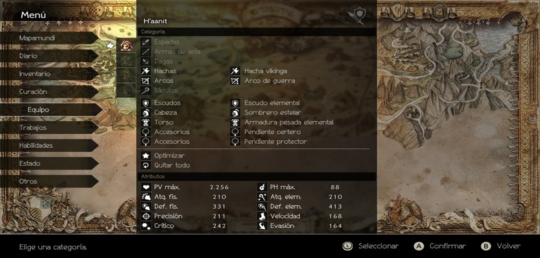

# EJERCICIOS SOBRE MÉTODOS

## Operaciones sobre arrays
Programa en Java que pueda realizar operaciones en un vector de números decimales (double). El programa debe ser capaz de realiza las siguientes operaciones:

1. Llenar el Vector: Un número entero n como parámetros con números decimales generados aleatoriamente.

2. Imprimir el Vector: Imprimir todos los números decimales del vector.

3. Calcular la Media: Calcular y devolver la media de todos los números decimales en el vector.

4. Encontrar el Número más Cercano a la Media: Debe encontrar y devolver el número en el vector que está más cerca de 
   la media.

[Solución](solucionesPropuestosClase/OperacionesArraysDouble.java)

## Ejercicio de búsqueda en vectores
Escribe un programa en Java que declare un vector de 5 elementos de tipo String. Llena el vector con palabras aleatorias (Scanner) y luego crea un método que reciba una palabra y busque esa palabra en el vector. El método debe devolver la posición de la palabra en el vector si la encuentra, o un mensaje indicando que la palabra no se encontró si no está en el vector.

[Solución](solucionesPropuestosClase/BusquedaVectores.java)

## Serie de Fibonacci
Escribe un programa que pregunte al usuario cuantos números de la serie de Fibonacci quiere y los almacene en un 
vector con n espacios utilizando un método recursivo mostrado anteriormente (y que luego lo muestre por pantalla). La serie de Fibonacci es una serie en la que cada número es la suma de los dos números anteriores. Los primeros números de la serie de Fibonacci son: 0, 1, 1, 2, 3, 5, 8, 13, 21, 34, 55, 89, 144, 233, 377, 610,
987, 1597…

[Solución](solucionesPropuestosClase/SerieFibonacci.java)

## Adivina
Crea un vector de números de un tamaño ELEGIDO POR EL USUARIO, el vector contendrá números aleatorios ente 1 y 300 y mostrará aquellos números que acaben en un dígito que nosotros le indiquemos por teclado (debes controlar que se introduce un número correcto), estos deben guardarse en un nuevo vector.

Por ejemplo, en un vector de 10 posiciones e indicamos mostrando los números acabados en 5, podía salir 155, 25, etc.

[Solución](solucionesPropuestosClase/Adivina.java)

## Calculadora áreas y volúmenes
Realiza una actividad que cumpla los siguientes objetivos:

Preguntar al usuario que quiere imprimir, área o volumen.

Preguntar al usuario que figura quiere imprimir, si anteriormente ha respondido área se preguntara cuadrado, triangulo y circulo. Si responde volumen se preguntara cubo, pirámide i cilindro.

Todos los cálculos se realizarán en métodos y en el main solo estarán las preguntas anteriormente dichas, las 
llamadas y la solución, las longitudes se habrán de preguntar dependiendo la figura.

¡Buena suerte!

[Solución](solucionesPropuestosClase/CalculadoraAreaVolumen.java)

# EJERCICIOS SOBRE ÁMBITO DE VARIABLES Y SOBRECARGA DE MÉTODOS

## Comprobar variables globales
Declara una variable global (fuera del método main) de esta forma:

    int casa = 4;
    String jardin = "grande";

Luego llámala dentro del método main y cámbiale el valor para comprobar que puede ser vista desde dentro de main.
Imprime por pantalla el nuevo valor de casa y jardín para comprobar que se han realizado los cambios.

[Solución](solucionesPropuestosClase/AmbitoVariableEjercicio1.java)

## Habitantes por km2

Haz un programa que calcule los habitantes por km2 de la siguiente forma:
- Declara fuera del método main una variable con los km2 de la Comunidad Valenciana.
- El método main solo se utilizará para calcular el % e imprimir por pantalla.
- Crea un método para hacer el cálculo de habitantes por km2 de la provincia de Valencia.
- Crea un método para hacer el cálculo de habitantes por km2 de la provincia de Castellón.
- Calcula en el main el % de km2 que ocupan las provincias de Valencia y Castellón utilizando la variable global.
- Imprime los tres resultados por pantalla.

Datos:
km2 Comunidad Valenciana = 23.255
km2 provincia de Valencia = 10.000
km2 provincia de Castellón = 6.600
habitantes provincia de Valencia = 2,5 millones
habitantes provincia de Castellón = 571.000

[Solución](solucionesPropuestosClase/AmbitoVariableEjercicio2.java)

## Calculadora sobrecargada
Define una clase llamada calculadora que tenga métodos para realizar operaciones básicas como suma, resta, multiplicación y división. Implementa la sobrecarga de métodos para permitir que la calculadora pueda sumar dos números, restar tres números, multiplicar cuatro números y dividir dos números.

[Solución](solucionesPropuestosClase/CalculadoraSobrecargada.java)

## Conversor unidades de medida
Crea una clase llamada Convertidora que tenga métodos para convertir entre diferentes unidades de medida, como metros a kilómetros, centímetros a pulgadas y kilogramos a libras. Implementa la sobrecarga de métodos para permitir que la clase pueda realizar estas conversiones con un solo parámetro o con dos parámetros (por ejemplo, metros a kilómetros y centímetros a pulgadas)

[Solución](solucionesPropuestosClase/Conversor.java)

## Calculadora variables globales
Desarrolla una aplicación en Java que simule el funcionamiento de una calculadora básica.
La calculadora debe ser capaz de realizar operaciones de suma, resta, multiplicación y división.
Para este ejercicio, debes utilizar variables globales para almacenar el resultado de las operaciones.
Además, la aplicación debe permitir al usuario introducir los números con los que se realizarán las operaciones y seleccionar la operación a realizar.

[Solución](solucionesPropuestosClase/CalculadoraVariablesGlobales.java)

## Volumen figura geométrica
Desarrolla una aplicación en Java que permita al usuario calcular el volumen de una figura geométrica.
La aplicación debe solicitar al usuario que introduzca el tipo de figura (por ejemplo, esfera, cubo, cilindro) y luego solicitar los datos necesarios para calcular el volumen de la figura seleccionada (por ejemplo, el radio para una esfera, el lado para un cubo, el radio y la altura para un cilindro). Para este ejercicio, debes utilizar variables globales para almacenar el tipo de figura y los datos introducidos por el usuario.

[Solución](solucionesPropuestosClase/CalculadoraVolumen.java)

## Calculadora utilizando sobrecarga de métodos

Supongamos que estás creando una clase llamada Calculadora que tiene métodos para realizar operaciones matemáticas simples. 
Tu tarea es la de implementar la sobrecarga de métodos para la clase Calculadora que permita realizar operaciones de 
suma con diferentes tipos de datos (enteros, flotantes y cadenas). Debes crear los métodos sumar que acepten dos argumentos y devuelvan la suma de esos valores.
Todos los valores de los métodos los indicaréis dentro del código esto quiere decir que no los pedirá el usuario.

[Solución](solucionesPropuestosClase/CalculadoraMetodos.java)

## Operaciones con arrays utilizando la sobrecarga de métodos

Supongamos que estás creando una clase llamada OperacionesArrays que contendrá métodos para realizar operaciones con arrays.
El objetivo a conseguir es implementar la sobrecarga de métodos para la clase OperacionesArrays, de manera que puedas realizar las siguientes operaciones:

- Encontrar el máximo valor en un array de enteros.
- Encontrar el máximo valor en un array de números decimales.
- Calcular la suma de todos los elementos en un array de enteros.
- Calcular la suma de todos los elementos en un array de números decimales.

Todos los valores de los arrays los indicaréis dentro del código esto quiere decir que no los pedirá el usuario.

[Solución](solucionesPropuestosClase/ArraysMetodos.java)

# EJERCICIOS SOBRE PILA Y RECURSIVIDAD

## Pila Simple

Crea un programa que tenga tres métodos (metodoA, metodoB, metodoC). Cada método debe imprimir un 
mensaje indicando en qué método está y luego llamar al siguiente método. Al final, muestra la pila de llamadas.

## Ejemplo de pila de llamadas
En este ejercicio de Java, se presenta un código que simula una secuencia de procesos con operaciones sobre matrices y utiliza una pila de llamadas. En procesoUno, se llama a procesoDos y se realizan operaciones de suma de matrices A y B. En procesoDos, se llama a procesoTres y se efectúa la resta de matrices C y D. La función procesoTres muestra detalles de la pila de llamadas

[Ver ejemplo]()

## Contador dígitos recursivo

Haz un programa en Java que cuente los dígitos de un número entero utilizando recursividad.
El programa debe solicitar al usuario que ingrese el número.
Y utilizando una función recursiva debe determinar y mostrar por pantalla el número de dígitos que lo componen.

[Solución](solucionesPropuestosClase/ContadorDigitosRecursivo.java)

## Multiplicador recursivo

Haz un programa en Java que resuelva multiplicaciones de 2 números utilizando recursividad.
El programa debe solicitar al usuario que ingrese los 2 números que desea multiplicar.
Y utilizando una función recursiva debe determinar y mostrar por pantalla el resultado de la multiplicación de ambos.

[Solución](solucionesPropuestosClase/MultiplicacionRecursiva.java)

## Dibuja triángulo
Usando métodos recursivos, consigue que la consola imprima un triángulo de altura introducida previamente por el 
usuario como el siguiente:

         *
         **
         ***

[Solución](solucionesPropuestosClase/Triangulo.java)

## Numero Invertido

Crea un método recursivo que dado un número entero positivo, lo imprima invertido por pantalla.
Por ejemplo si introdujéramos 540, por pantalla nos devolvería 045.

[Solución](solucionesPropuestosClase/NumeroInvertido.java)

## Suma Números

Crea un programa con un método recursivo que calcule la suma de los primeros n números enteros positivos.

[Solución](solucionesPropuestosClase/SumaNumeros.java)

## Contar Dígitos

Crea un programa con un método recursivo que obtenga la cantidad de dígitos de un número n mayor que 0.

[Solución](solucionesPropuestosClase/ContarDigitos.java)

## Suma Recursiva de un Array

Crea un programa que con un método recursivo calcule la suma de todos los elementos de un array de números enteros

[Solución](solucionesPropuestosClase/SumaRecursiva.java)

# EJERCICIOS SOBRE ARRAYLIST Y VARARGS

# ArrayList operaciones básicas

Crea un programa en el que el usuario introduzca por teclado elementos en un ArrayList de tipo STRING hasta que introduzca una palabra clave que finalice la entrada de elementos, después se le mostrará un menú con una serie de opciones para que elija que quiere hacer. El menú volverá a mostrársele después de cada operación.

- Opción 1: Mostrar la lista							
- Opción 2: Agregar un elemento nuevo al ArrayList
- Opción 3: Buscar un elemento y mostrar la posición (o posiciones) en la que se encuentra en caso de encontrarlo
- Opción 4: Eliminar un elemento (se le preguntara si por índice, o si desea introducir una palabra y que, en caso de 
  que exista en el ArrayList, sea eliminada)
- Opción 5: Modificar un elemento (se le preguntara la palabra por la que se desea sustituir y se le preguntara si 
  por índice, o si desea introducir una palabra y, en caso de que exista en el ArrayList, sea modificada por la que haya introducido)
- Opción 6: Limpiar la lista
- Opción 7: Ordenar la lista (la ordena y la muestra ordenada)		
- Opción 8: Salir del programa	

Cada opción debe de ser un método diferente, para hacer el programa lo más modular posible y así practicar métodos.

Acordaos de ser lo más “User Friendly” posible, dando mensajes claros y respuestas, así como controlando posibles errores en inputs, etc.	

[Solución](solucionesPropuestosClase/JugarConListas.java)

## Calcular promedio

Haz un programa que, mediante un método que acepte un numero variable de números en forma de argumento (VarArgs), devuelva el promedio de esos números.

[Solución](solucionesPropuestosClase/CalcularPromedio.java)

## Imprimir lista

Crea un programa con un método que acepte un número indeterminado de argumentos de tipo texto y que los imprima por pantalla.

[Solución](solucionesPropuestosClase/ImprimirLista.java)

# EJERCICIOS SOBRES OBJETOS Y CLASES

## Probar estudiante

Crear una clase 'Estudiante' que contenga atributos como nombre, edad y grado. 

Luego, instancia objetos de esta clase para representar varios estudiantes, asignándoles valores y mostrando información como 'nombre, edad y grado' mediante métodos de la clase.

[Solución](solucionesPropuestosClase/estudiantes/PruebaEstudiantes.java)

## Gestión trabajadores

Crea un programa que pida al usuario por pantalla una cantidad de trabajadores. 

Después que pregunte por trabajador sus datos personales (Nombre, Edad, Sueldo) y en qué proyecto (Nombre, 
descripción) está trabajando. 

Para finalizar, que lo muestre por pantalla.

- Cada vez que se pregunten los datos de un trabajador tiene que reproducirse este mensaje

        Datos de trabajador 1:
        Preguntar datos
        Datos proyecto trabajador 1:
        Preguntar datos

- Si no se introducen datos en un trabajador cuando se muestren los datos por pantalla tiene que salir un texto que 
diga “vacio” (utiliza 'isEmpty')
- Cuando se muestre al final la información por pantalla se tiene que mostrar en este orden

      Datos de trabajador 1:
      información
      Datos proyecto trabajador 1:
      información

[Solución](solucionesPropuestosClase/trabajadores/GestionTrabajadores.java)

## Cuenta bancaria

Crea una clase llamada CuentaBancaria con los siguientes atributos:
- Número de cuenta
- Saldo

Implementa métodos para depositar y retirar dinero de la cuenta. Asegúrate de que el saldo no pueda volverse negativo.
Crea otro método que imprima en la consola el saldo actual de la cuenta.

En main, crea al menos dos objetos, realiza algunas transacciones y muestra el saldo actual después de cada transacción.

[Solución](solucionesPropuestosClase/banco/GestionBanco.java)

## Librería

Crear una clase Libro que contenga los siguientes atributos:
- ISBN
- Título
- Autor
- Número de páginas

Deben de haber al menos 6 libros. Que le pidamos al usuario: el título o el ISBM del libro. Y muestre por pantalla la información del libro.

[Solución](solucionesPropuestosClase/libreria/Principal.java)

## Personajes y atributos

A partir del ejemplo de como crear un constructor. A partir de la imagen de Ejemplo tienes que replicarlo con un constructor en Java, puede ser el mismo de la imagen o un personaje completamente nuevo. 

Crea un constructor con la clase Personaje.

Con los atributos: Nombre, arma1, arma2, escudo, torso, Acessorio1, accessorio2.

Y otra clase Estadistica con los siguientes atributos: PV (puntos de vida), PH (Puntos de habilidad), AtqFis (ataque físico), AtqElem (Ataque elemental), DefFis (Defensa Física), DefElem(Defensa Elemental), Prec (Precisión), Vel (Velocidad), Cric (Crítico) y Evas (Evasión).

El programa debe crear dos o más personajes y preguntar al usuario que atributo quiere saber he imprimirlo por pantalla.

[Solución](solucionesPropuestosClase/Personajes/Main.java)
