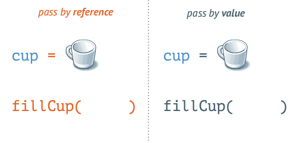

# PROGRAMACIÓN MODULAR

Volvemos a ver como se aplica el "Divide y vencerás" en programación.

Con la programación estructurada que aparece a partir de Dijkstra, se avanza en cuanto a legibilidad.
Pero el código sigue siendo extremadamente largo y difícil de seguir: Acaba apareciendo el concepto de módulo. 

Las partes en que se divide un programa se pueden desarrollar independientemente entre sí, y se denominan 
'MÓDULOS', siendo estos subprogramas o subalgoritmos. El problema principal se soluciona con el programa o algoritmo 
principal y los subproblemas con subprogramas, que pueden ser funciones o procedimientos.

En Java podríamos hacer la siguiente igualdad MÓDULO == MÉTODO

## Función
Subprograma que recibe uno o más datos de entrada y devuelve un único resultado, asociado al nombre de la función.

Las funciones necesitan ser definidas y declaradas una vez y pueden ser llamadas tantas veces como se desee.

Lo primero que hay que hacer antes de utilizar una función es, definirla y para hacerlo hay que construir dos partes:
-	__Cabecera__, formada por el tipo de dato que devuelve, el nombre de la función y los parámetros de dicha función.
-	__Cuerpo__, donde se definen las variables locales y las acciones o instrucciones a realizar.

Hay dos tipos de funciones.
-	Las propias del lenguaje de programación
-	Las definidas por el usuario

## Procedimiento
La estructura de un procedimiento es similar a la de una función, pero con una diferencia principal, al nombre del procedimiento no se le asocia el tipo de dato a devolver, porque puede no devolver ninguno, o en caso de devolverlos lo hace a través de los parámetros. 

Aquí entra en juego el tipo de paso de parámetros que veremos un poco más adelante.

Para entender un poco mejor la diferencia entre ambos, que de forma teórica quizá es algo más complejo, vamos a exponer un ejemplo:

    Programa principal: Informar a cada alumno mediante email de la nota media conseguida durante el curso. 

        Para indicar la nota media de cada uno, llamará y ejecutará por cada alumno, la función que calcula la media de sus notas.
    
        A continuación, para cada alumno, el programa llamará y ejecutará un procedimiento que se encargará de enviar un correo electrónico indicando la nota media, a cada uno de ellos.
    
    Función: Cálculo de media

        Toma el control, calcula la media con ayuda de todas las notas del alumno. Cuando termina el cálculo, devuelve el resultado: la media calculada.

    Procedimiento: Envía email

        Toma el control, envía email, termina su trabajo y devuelve el control al programa principal. No entrega ningún valor.

## Comunicación con subprogramas: Parámetros

Parámetro en matemáticas se describe cómo:

    Variable que aparece en una ecuación cuyo valor se fija a voluntad

En Java:

    Son variables que se utilizan para recibir información en un método.

### Paso de parámetros
Para que las acciones descritas en un subprograma función sean ejecutadas, se necesita que este sea invocado
desde un programa principal o desde otros subprogramas a fin de proporcionarle los argumentos de entrada necesarios
para realizar esas acciones.
Los argumentos de la declaración de la función se denominan parámetros formales y solo se utilizan dentro del cuerpo
de la función.
Por contra, los argumentos utilizados en el momento de llamada a la función se denominan parámetros actuales. Estos
parámetros pueden ser constantes, variables, expresiones, valores de funciones o nombres de otras funciones o
procedimientos.

Cada vez que se llama a una función desde el algoritmo principal se establece automáticamente una correspondencia
entre los parámetros formales y los parámetros actuales. Debe haber exactamente el mismo número de parámetros
actuales que de parámetros formales en la declaración de la función y se presupone una correspondencia uno
a uno de izquierda a derecha entre los parámetros formales y los actuales.

       - Parámetros formales: argumentos de la declaración de una función
       - Parámetros actuales: argumentos utilizados en la llamada a la función.

Una llamada a la función implica los siguientes pasos:
1. La llamada se realiza a través de su nombre, seguido de los argumentos que se quieran introducir como datos de 
   entrada, es decir, los parámetros actuales.
2. en la función, a cada parámetro formal se le asigna el valor real de su correspondiente parámetro actual. 
3. Se ejecuta el cuerpo de acciones de la función. 
4. Se devuelve el valor de la función y se retorna al punto de llamada.

Existen dos métodos para establecer el paso entre parámetros:

- __Paso por valor__: los parámetros formales reciben una copia de los valores de los parámetros actuales. Por tanto, 
  si se realiza un cambio en ellos dentro de una función o procedimiento, no afectará al valor en el programa principal. Es decir, los valores formales ocupan una zona de memoria distinta a los actuales.
- __Paso por referencia__: lo que se pasa al subprograma es la dirección de memoria del parámetro actual. De esta forma 
  la variable se comparte entre el programa y el subprograma y se puede modificar. Es decir, parámetros formales y actuales ocupan la misma dirección de memoria. 

