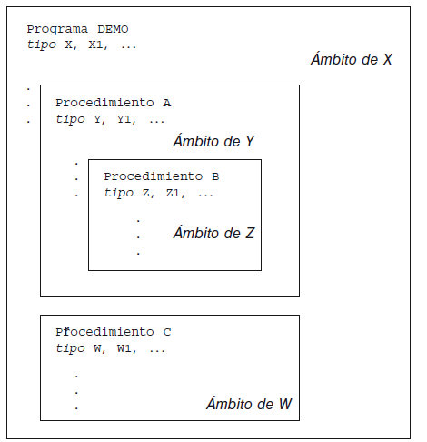
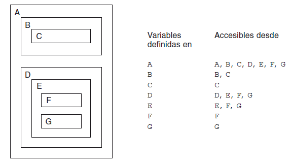
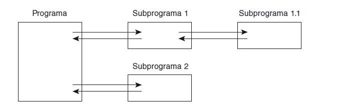
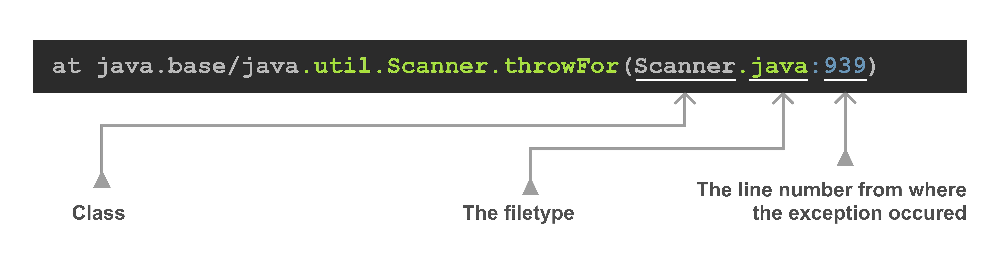
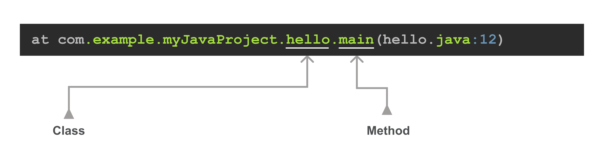
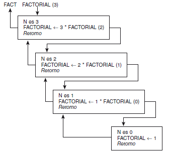

# MÉTODOS

En Java representan a las funciones y procedimientos, ya que pueden retornar o no un OUTPUT.

## Declaración

### Método sin parámetros y sin retorno:

    public void saludar() {
        System.out.println("¡Hola, mundo!");
    }

## Llamada al método

### CON parámetros

    int a = 2;
    int b = 5;
    int resultado = suma(a, b);

### SIN parámetros
    saludar();     

## A tener en cuenta:
- Los métodos se declaran utilizando una estructura específica y pueden tener parámetros y un tipo de dato devuelto.
- Deben realizar una tarea específica que debe quedar bien específicada por su nombre.
- Se deben utilizar para evitar repeticiones de bloques de código, lo cual es difícil de mantener.  
- Se llaman utilizando su nombre seguido de paréntesis, y se pueden pasar argumentos correspondientes si es necesario.
- Los métodos solo pueden devolver un valor.
- Los métodos con output utilizan la palabra clave return para devolver un valor.
- La ejecución de un método termina inmediatamente después de ejecutar un return.
- Los parámetros pueden ser pasador por valor o por referencia.
- Los argumentos se pasan a un método al llamarlo y deben coincidir en tipo y cantidad con los parámetros definidos en el método.

Comprender en profundidad la palabra clave __static__ no es el objetivo de este tema, entraremos en profundidad más 
adelante. Pero a modo de introducción, utilizarla implica, poder hacer uso del método que estamos definiendo 
evitando la creación de una instancia de un objeto de la clase.

# PARÁMETROS / VARIABLES
Vamos a ver ejemplos concretos de paso de parámetros actuales a formales, tanto por valor, como por referencia.

### Ejemplo [Paso de parametros](HolaUsuario.java)
### Ejemplo [Paso de parametros 2](SenoCoseno.java)

## Paso por valor
Los parámetros crean una copia del valor original y cualquier modificación se realiza en la copia, sin 
afectar la variable original.
### Ejemplo [Paso de parámetros por valor](PasoPorValorDemo.java)

## Paso por referencia
Los parámetros pasan la dirección de memoria del objeto, lo que permite modificar el estado del objeto original.

### Ejemplo [Paso de parámetros por referencia](PasoPorReferencia.java)

## AHORA SÍ: String[] args

Pues ahora que ya conocemos lo que son los arrays y el paso de parámetros en los métodos, podemos entender que
args es el nombre del array de Strings, que puede recibir como argumento el método main.

[Demo](DemoArgs.java)

# Ámbito de una variable
El ámbito es la parte del programa donde la variable es accesible.
Se llama SCOPE en inglés.

## Local a un método 
Una variable local es aquella que está declarada y definida dentro de un subprograma y por tanto, es distinta de las 
variables con el mismo nombre declaradas en cualquier parte del programa principal. 

El significado de una variable se confina al procedimiento en el que está declarada. Cuando otro subprograma utiliza 
el mismo nombre se refiere a una posición diferente en memoria. Una variable local a un subprograma no tiene ningún 
significado en otros subprogramas.

### Local a un bloque de código
Son aquellas declaradas dentro de estructuras de control, que únicamente son alcanzables dentro de la misma.

## Global
Una variable global es aquella que está declarada para el programa o algoritmo principal, del que dependen todos
los subprogramas.

Tienen la ventaja de compartir su información entre diferentes subprogramas sin tener que ser enviada como parámetro.

# MÁS DETALLES SOBRE LAS FUNCIONES

## Sobrecarga de métodos (Overloading)

Capacidad para crear múltiples versiones de un mismo método con el mismo nombre, pero con diferentes listas de 
parámetros. Esto implica que se pueden crear múltiples funcionalidades con el mismo nombre de un método, 
siempre y cuando los parámetros sean diferentes.

Permite:
- Tipo de parámetros diferentes
- Cantidad de parámetros diferentes
- Orden de los parámetros diferentes diferente.

Ventajas:

- Código más limpio, 
- mayor claridad y 
- facilidad de mantenimiento

[Demo](DemoSobrecarga.java)

Ejemplo de utilidad avanzado... ¿Y si necesitamos encender un motor? en realidad tenemos diferentes tipos de 
encendido: eléctrico, encendido térmico, encendido de combustión, etc. En cada caso los procesos son muy 
diferentes pero el objetivo es el mismo. Cada uno necesita ciertas características únicas para encender, así que 
podríamos aplicar la sobrecarga para no preocuparnos por llamar a diferentes métodos por su nombre particular sino tan 
solo llamando al mismo pero enviando los parámetros (características) propios de cada tipo de motor y listo.

### varargs
Proporciona una abreviatura en la cabecera del método para hacer que este admita una cantidad arbitraria de 
parámetros de un mismo tipo. 
Puede ser que venga un parámetro, 20, o puede que no venga ninguno.

Imaginemos:
         
    public String format() { ... }
    public String format(String value) { ... }
    public String format(String val1, String val2) { ... }
    public String format(String... values) { ... }

[EJEMPLO 1](DemoVarargs.java)

Cuando es necesario pasar varios argumentos a un método y además un vararg, este debe estar siempre al final, para 
poder ser capaces de detectar

[EJEMPLO 2](DemoVarargsFinal.java)

## Pila de llamadas (Stack trace o backtrace)

La pila es una estructura de datos lineal que se basa en el principio de último en entrar, primero en salir (LIFO). 
Es como una anti-cola. Imaginemos que metemos libros en una caja, el libro que hemos puesto el primero, está abajo 
del todo, en la parte inferior y no podemos sacarlo, será el último en salir. Por contra, el último que hemos metido,
será el primero que sacaremos de la caja. 

En java, la forma de organizar las llamadas a subrutinas (métodos) es mediante el uso de una pila. La pila almacena la 
dirección de retorno de la subrutina. Con cada llamada anidada (incluida la recursiva) de subrutinas, se agregan nuevas direcciones de retorno a la pila. Con cada operación de retorno de la subrutina (retorno), la dirección de retorno se elimina de la pila y se le transfiere el control. 
Esta aplicación es tan importante para la programación que en muchos procesadores, la pila se implementa en hardware.

Una JVM en ejecución tiene un área especial de memoria, llamada Stack memory, para almacenar la pila. El tamaño de 
esta área de memoria depende de la configuración del sistema operativo y la JVM. 
Por otro lado, existe otra área de memória llamada Heap memory, que es donde se almacenan las variables primitivas y las 
direcciones de las variables que se pasan por referencia y que se utilizan como parámetros de referencia. 

[Para saber algo más sobre la memoria heap y stack](2.2_MemoriaJVM.md)

Cuando se produce un error o una excepción, Java nos muestra el seguimiento de la pila y es muy útil para depurar y 
poder solucionar el problema.

En el siguiente ejemplo vamos a ver como funciona la pila de llamadas de Java y como se muestra al lanzarse una 
excepción:

[Demo](DemoStackTrace.java)

Vamos a ver un ejemplo menos intuitivo, en el que si en lugar de un float, introducimos un string se produce el 
siguiente error:

        Exception in thread "main" java.util.InputMismatchException
            at java.base/java.util.Scanner.throwFor(Scanner.java:939)
            at java.base/java.util.Scanner.next(Scanner.java:1594)
            at java.base/java.util.Scanner.nextFloat(Scanner.java:2496)
            at teoria.CelsiusToFarenheit.celsiusToFarenheitError(CelsiusToFarenheit.java:17)
            at teoria.CelsiusToFarenheit.main(CelsiusToFarenheit.java:8)

Y como fácilmente podemos controlar esto con un bloque try/catch.

[DemoCelsiusToFarenheit sin y con gestión de errores](CelsiusToFarenheit.java)

## Recursividad

Dicho de forma sencilla, la recursividad se produce cuando una función o procedimiento se llama a sí mismo.
Es una técnica de programación que nos permite que un bloque de instrucciones se ejecute n veces, reemplazando así, 
a las estructuras repetitivas.
Una de las claves para saber que un problema podría resolverse usando recursividad es detectar los dos casos siguientes:
- El caso base es el caso al que toda función recursiva tiene que acabar llegando para dar por resuelto el caso más 
simple del problema que queremos resolver. Si no definimos un caso base dentro de nuestra solución recursiva llamaremos a nuestra función infinitas veces hasta que acabemos con todos los recursos del sistema.
- El caso recursivo, suele ser una función que es capaz de autoinvocarse. La clave de esta autoinvocación es que los 
  elementos que le pasemos tendrán que ser menores que los del problema padre para que podamos llegar al caso base.

Ejemplo utilizando un método iterativo:

    public static int FactorialIterativo(int numero)
    {
        int i, resultado = 1;
        for(i=1; i <= numero; i++)
        {
            resultado = resultado * i;
        }
        return resultado;
    }

El ejemplo utilizando método recursivo:

    public static int FactorialRecursivo(int numero)
    {
        if (numero < 2) return 1;
        return numero * FactorialRecursivo(numero - 1);
    }

La recursividad permite definir ciertos problemas de modo mucho más natural que aplicando iteración, pero a costa de un mayor consumo de recursos. En un programa iterativo, la cantidad de memoria consumida se reduce a los datos utilizados y al posible uso de asignaciones dinámicas de memoria. Sin embargo, el cálculo de la memoria utilizada por un programa recursivo es más complicado, ya que además de tener en cuenta el tamaño de los datos utilizados, habrá que contemplar el espacio ocupado en la pila de llamadas cada vez que una función se llama a sí misma.

La recursividad siempre atrae críticas y escepticismo por la cantidad de recursos que necesitas para llegar a una 
solución, pero muchos lenguajes de programación funcional no cuentan ni con sintaxis para realizar bucles por lo que simplemente pueden recorrer arrays por medio de recursividad.

## Stackoverflow

Se produce cuando hay un desbordamiento en la pila, es decir, se produce sobreescritura de la información actual, ya 
sea por demasiada información o porque las variables ocupan más del espacio reservado para ellas. 

El programa devuelve el error StackOverflowError y habitualmente es causado por una recursión infinita, pero tambien 
se trata de una vulnerabilidad que intenta explotar los hackers.

[Ejemplo reciente de aplicaciones con vulnerabilidad en la pila](https://www.incibe.es/incibe-cert/alerta-temprana/avisos/vulnerabilidad-de-desbordamiento-de-pila-en-productos-de-fortinet)

[Demo ejemplo de stackoverflow](DemoStackOverflow.java)

## Efectos secundarios y Funciones puras

__Efecto secundario__

Cualquier cambio de estado en el sistema o interacción observable con el exterior, que ocurre durante el cálculo del 
resultado de una función.

Algunos ejemplos comunes de efectos secundarios serían:

- mutar datos.
- modificar archivos.
- insertar un registro en una base de datos.
- hacer una llamada http.

En esencia, cualquier interacción con el mundo exterior a una función, es un efecto secundario. Viéndolo de esta 
forma, programar funciones sin efectos secundarios parece poco práctico y poco útil pero, en realidad, no es que 
nuestras funciones no puedan interactuar con el exterior, sino que deben hacerlo de manera específica y controlada

Una función pura es aquella que cumple dos características muy concretas:

- Es idempotente (mismo resultado si se ejecuta una o varias veces) [Link para ver la idempotencia](https://www.adictosaltrabajo.com/2015/06/29/rest-y-el-principio-de-idempotencia/)
- No produce efectos secundarios

__Beneficio del uso de funciones puras__

Transparencia referencial. Un pedazo de código tiene transparencia referencial cuando puede ser sustituido por el 
resultado de su evaluación sin alterar el comportamiento del programa. La transparencia es que hace el código sea más fácil de comprender.

Cacheabilidad. Cuando ejecutamos una función por primera vez con cierto argumento, podemos guardar su resultado en 
caché y la próxima vez que se invoque la misma función con el mismo argumento, ya no es necesario ejecutarla sino 
que podemos devolver el valor almacenado en caché.

Portabilidad. Las funciones puras son completamente autosuficientes; disponen internamente de todo lo que necesitan para operar.  

Testeabilidad. Son más sencillas de testear ya que, no necesitamos simular los estados que requiere nuestro código 
para operar. Simplemente, invocamos la función y evaluamos su resultado.

[EJEMPLO](DemoFuncionPura.java) 
