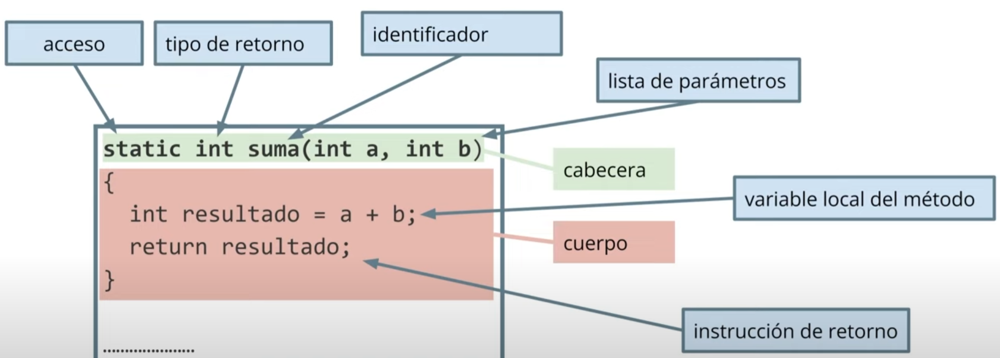

# MÉTODOS

En Java representan a las funciones y procedimientos, ya que pueden retornar o no un OUTPUT.

## Declaración

### Método sin parámetros y sin retorno:

    public void saludar() {
        System.out.println("¡Hola, mundo!");
    }

## Llamada al método

### CON parámetros

    int a = 2;
    int b = 5;
    int resultado = suma(a, b);

### SIN parámetros
    saludar();     

## A tener en cuenta:
- Los métodos se declaran utilizando una estructura específica y pueden tener parámetros y un tipo de dato devuelto.
- Deben realizar una tarea específica que debe quedar bien específicada por su nombre.
- Se deben utilizar para evitar repeticiones de bloques de código, lo cual es difícil de mantener.  
- Se llaman utilizando su nombre seguido de paréntesis, y se pueden pasar argumentos correspondientes si es necesario.
- Los métodos solo pueden devolver un valor.
- Los métodos con output utilizan la palabra clave return para devolver un valor.
- La ejecución de un método termina inmediatamente después de ejecutar un return.
- Los parámetros pueden ser pasador por valor o por referencia.
- Los argumentos se pasan a un método al llamarlo y deben coincidir en tipo y cantidad con los parámetros definidos en el método.

Comprender en profundidad la palabra clave __static__ no es el objetivo de este tema, entraremos en profundidad más 
adelante. Pero a modo de introducción, utilizarla implica, poder hacer uso del método que estamos definiendo 
evitando la creación de una instancia de un objeto de la clase.

# PARÁMETROS / VARIABLES
Vamos a ver ejemplos concretos de paso de parámetros actuales a formales, tanto por valor, como por referencia.

### Ejemplo [Paso de parametros](HolaUsuario.java)
### Ejemplo [Paso de parametros 2](SenoCoseno.java)

## Paso por valor
Los parámetros crean una copia del valor original y cualquier modificación se realiza en la copia, sin 
afectar la variable original.
### Ejemplo [Paso de parámetros por valor](PasoPorValorDemo.java)

## Paso por referencia
Los parámetros pasan la dirección de memoria del objeto, lo que permite modificar el estado del objeto original.

### Ejemplo [Paso de parámetros por referencia](PasoPorReferencia.java)

# AHORA SÍ: String[] args

Pues ahora que ya conocemos lo que son los arrays y el paso de parámetros en los métodos, podemos entender que 
args es el nombre del array de Strings, que puede recibir como argumento el método main. 

[EJEMPLO 1](DemoArgs.java)
