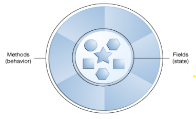
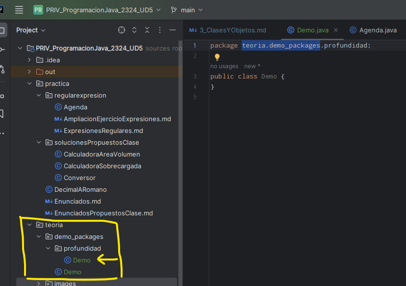
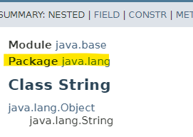
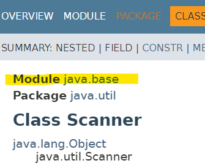

# OBJETOS Y CLASES
Son los elementos clave para comprender la programación orientada a objetos. 

Vamos a ver como el código se organiza en unidades denominadas clases, de las cuales se crearán objetos que se 
relacionarán entre sí para conseguir los objetivos de las aplicaciones. 

Pensemos en objetos del mundo real: un coche, una mesa, un perro...

Todos los objetos comparten dos cosas, tienen: 
   - Unas características o estados
   - y comportamientos

Identificar las características y/o estado y el comportamiento de los objetos del mundo real es la forma de 
programar con orientación a objetos.

Los perros tienen:
   - Características o estados: nombre, color, raza, hambre, sed, está paseado.
   - Comportamientos: Ladrar, buscar, menear la cola). 
Las bicicletas:
   - Características o estados: marcha actual, cadencia de pedaleo actual, velocidad actual
   - Comportamiento: cambiar de marcha, modificar de cadencia de pedaleo, aplicación de frenos

Como los objetos de la vida real puede que sean muy simples o, por el contrario, puede que tengan una elevada 
complejidad:

Una lámpara: 
    - Estados: Encendido y apagado.
    - Comportamientos: Encender y apagar.

Una radio:
    - Estados: encendido, apagado, volumen actual, estación actual
    - Comportamientos: encender, apagar, subir volumen, bajar volumen, buscar, escanear y sintonizar.

También podremos observar algunos objetos, que, a su vez, también contendrán otros objetos.

Supongamos un objeto de la vida cotidiana y vamos a tratar de modelizarlo en un esquema OO (Orientado a Objetos): un coche.

- Características: el color, el modelo, la marca, cilindrada, año matriculación, propietario, ITV...
- Comportamientos: arrancar, parar, acelerar, cambiar propietario, fecha próxima ITV... 

El "coche" sería lo que se conoce como "Clase" y esta clase describe cómo son todos los coches del mundo, es decir, qué propiedades tienen y qué funcionalidades deben poder realizar.

    Una CLASE está formada por las instrucciones para construir un objeto, una clase es texto. 
    Un OBJETO es una representación en memoria de la clase, un objeto son bytes.

En el mundo real encontraremos muchos coches, con características iguales y diferentes a otros. En el caso del coche,
podemos encontrar coches de la misma marca, mismo modelo, pero a la vez diferentes. En términos orientados a objetos,
podemos decir que nuestro coche propio es una instancia de la clase de objetos conocidos como coche. Una clase es el 
modelo a partir del cual se crean los objetos individuales.

Ejemplo de una clase:

      class Coche {

         //Declaración de atributos
         int color;
         String marca;
         
         //Definición de métodos
         void arrancar(){…}
         void parar(){…}
         
         //Constructores
         Coche(){
            Super();
         }
         
         Coche(int c, string m){
            color = c;
            marca = m;
         }
      }

La clase agrupa la definición de las características de un del coche, como el color o la marca, a las que llamamos 
__atributos o propiedades__. Los __comportamientos o funcionalidades__, como arrancar o parar, las llamamos métodos.

El conjunto de métodos accesibles de una clase es su __API__ (Application Programing Interface).

Teniendo esto, ya podríamos crear un objeto de la clase, pero… ¿cómo? Para hacerlo necesitamos los __constructores__. 

El constructor es un método especial que se invoca cada vez que se genera un objeto de la clase a la que él 
pertenece. Dependiendo de las necesidades que tenga el objeto, una clase puede tener uno o varios constructores.

Para crear un objeto de la clase, con los constructores que tenemos disponibles, se haría de la siguiente manera:

    //Declarar objeto
    Coche madre = new Coche(rojo, seat);
    Coche padre = new Coche();
    
    //Cambiar propiedades de un objeto
    mama.color = amarillo;
    
    //Acción del objeto
    mama.arrancar();

__Nota:__ Importante llamar la atención en el ejemplo anterior sobre la sobrecarga de los constructores.

Con cada new, estamos generando una nueva instancia de la clase Coche, especificando unos atributos específicos que 
la identifican inequívocamente y que se van a almacenar en la variable mama. No hay que olvidar que también 
estaremos reservando espacio en la memoria.

A partir de una clase podemos crear cualquier número de objetos de esa clase y una vez tengamos un ecosistema de 
objetos, estos colaborarán entre sí para resolver los objetivos de las aplicaciones.

Cuando creamos una referencia a un objeto, pero no creamos el objeto, esta referencia es null.
Cuando necesitamos desasignar una referencia, la igualamos a null

    Coche nuevo; // Si hacemos referencia a coche, nos devolverá un null
    if(nuevo == null){ return true; } // Esta condición devuelve true
    nuevo = new Coche(); // Ahora nuevo apunta un objeto nuevo
    nuevo = null; // Ahora la referencia se ha perdido de nuevo.  

Importante decir que en Java no es necesario invocar a los destructores, ya que el recolector de basura los gestiona de manera transparente para el usuario.

[Demo de una clase y creación de objetos](Punt.java)
[Demo uso clase Punt con creación de objetos](DemoUsoPunt.java)

### Constructor por defecto
Si no especificamos ningún constructor en la clase, Java generará el constructor por defecto. Este constructor, 
aunque no se visualice en la clase, para el compilador será algo así:

      class Coche {

         //Declaración de atributos
         int color;
         String marca;

         //Constructores
         public Coche(){}

        //Definición de métodos
        void arrancar(){…}
        void parar(){…}
      }

En el momento en el que añadimos un constructor, donde no lo había, ya no se crea el constructor por defecto:

    class Coche {

         //Declaración de atributos
         int color;
         String marca;

         //Constructores
         Coche(int c, string m){
            color = c;
            marca = m;
         }

        //Definición de métodos
        void arrancar(){…}
        void parar(){…}
      }

Con la clase coche declarada de esta manera, ya no podríamos crear un objeto coche con la siguiente llamada:

    Coche mio = new Coche();

Para poder mantener el constructor vacío tendremos que esperar a la UD6.

### EJEMPLO: [clases y objetos](GestionPianos.java)

# PAQUETES (PACKAGES)

Son agrupaciones de elementos que nos ayudan a mantener organizado nuestra aplicación. También permiten darle 
seguridad adicional al proyecto, ya que como veremos en el siguiente tema, nos ayudan a mantener ocultos los 
elementos que necesitemos de nuestra aplicación.

Como elementos podemos incluir muchas cosas: clases java, interfaces, archivos de texto...

Características:
- El paquete es lo primero que se debe declarar en una clase, en la primera línea de código.
- Cada punto de la ruta, en realidad es una carpeta.
- El paquete debe nombrarse en minúsculas completamente, y si es estrictamente necesario añadir más de una palabra, 
  lo haremos mediante la adición de guiones bajos.

[Demo](demo_packages/profundidad/Demo.java)

Estructura de paquetes del ejemplo Demo, como si de un explorador de archivos se tratara

Las clases que conocemos y que hemos usado hasta el momento también tienen su package:

# LIBRERÍAS

Una librería en Java es un conjunto de clases con sus métodos y atributos característicos, que pueden utilizarse en 
otros proyectos. Con lo cual, el uso de librerías nos permite la reutilización de código.

Una librería puede estar formada por uno o varios packages.

Se puede hacer uso de librerías conocidas o podemos crearlas nosotros mismos.

Hasta ahora hemos hecho un uso intensivo de Scanner, pues bien, Scanner es una librería, incluída en el package:

Pero ¿Qué hemos necesitado incluir en nuestras clases para usarlo? El __IMPORT__ 

## Import

Estructura de código para importar librerías:

### Opción 1:

    package paquete.mipaquete;
    
    import paquete2.otropaquete.*;
    
    class Ejemplo1{}

La clase que estamos creando se llama Ejemplo1 y está en el paquete "paquete/mipaquete".

A continuación se ha realizado el import del paquete2.otropaquete.* y con el "*" hemos 
indicado a Java que queremos importar todas las clases pertenecientes a dicho paquete, puede ser una o más.

### Opción 2:

    package paquete.mipaquete;
    
    import paquete2.otropaquete.MiClase;
    
    class Ejemplo1{}

Se ha creado la clase de mismo nombre, pero se ha realizado el import del paquete2.otropaquete.MiClase. En este caso 
estamos concretando la clase del paquete que vamos a importar y, por lo tanto, no tendremos posibilidad de acceso a 
cualquier otra clase del paquete como sí teníamos en la opción 1.

La diferencia principal entre ambas, es la eficiencia. Imaginemos que queremos importar Scanner porque necesitamos 
recoger datos de teclado, pero en lugar de hacer el import que todos conocemos:

    import java.util.Scanner;

Hacemos el siguiente:

    import java.util.*;

En el primer caso, estamos importando a nuestro proyecto la clase exactamente que necesitamos: Scanner.
En el segundo, estamos importando a nuestro proyecto todas las clases que cuelgan del paquete java.util, lo cual 
implican un total de 76 clases para Java 17.

¿Cómo podemos ver esta información? [Java API package java.util](https://docs.oracle.com/en/java/javase/17/docs/api/java.base/java/util/package-summary.html)

# MÓDULOS
Para aquellos que quieran entrar en más detalle de agrupaciones de clases, también existen las agrupaciones de 
paquetes o módulos.

Os dejo la página de Oracle en la que se detalla su utilidad:
[https://www.oracle.com/es/corporate/features/understanding-java-9-modules.html](https://www.oracle.com/es/corporate/features/understanding-java-9-modules.html)

# ARRAYS DE OBJETOS
Nuestro compañero de [Aula en la nube](https://www.youtube.com/watch?v=LAgn2SC9O8E&list=PLG1qdjD__qH6ULjW5iN8E45m5nkaCNbUu&index=111) cuenta de forma muy detalla, como crear Arrays de 
objetos, que podremos aplicar a nuestros ejercicios.

# ARRAYLIST DE OBJETOS
Nuestro compañero de [Aula en la nube](https://www.youtube.com/watch?v=7IPH-Tbtb74&list=PLG1qdjD__qH6ULjW5iN8E45m5nkaCNbUu&index=111) cuenta de forma muy detalla, como crear Arrays de
objetos, que podremos aplicar a nuestros ejercicios.
